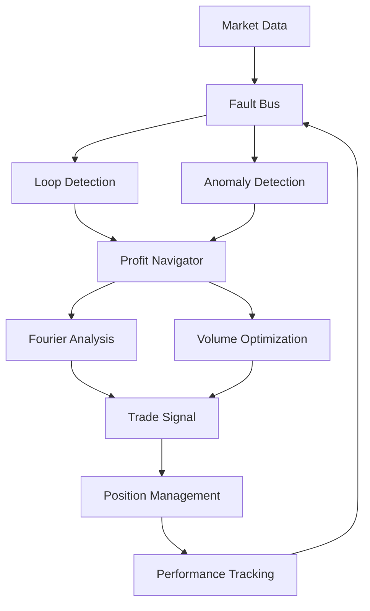

# Schwabot Mathematical Framework
## Profit-Fault Correlation with Recursive Loop Detection

This document explains the mathematical framework that prevents self-similar pattern locks while maintaining the ability to identify genuine profit cycles, inspired by JuMBO (Jupiter-Mass Binary Objects) research in the Orion Nebula.

## Core Mathematical Problem

The challenge you identified is **recursive profit pattern detection** where:

1. **Self-similar patterns** can create false profit cycles that loop infinitely
2. **Genuine profit tiers** exist but are rare and anomalous (like JuMBOs in Orion)
3. **Fault events** correlate with profit outcomes and can predict future cycles
4. **Data integrity** must be maintained to prevent tampering with profit signals

## Mathematical Framework Components

### 1. Recursive Loop Detection via SHA-256 Pattern Hashing

**Mathematical Foundation:**
```
P(t) = SHA256(entropy(t) || coherence(t) || profit_delta(t))
```

**Loop Detection Algorithm:**
```python
def detect_recursive_loop(pattern_hash, profit_delta):
    if pattern_hash in collision_count:
        collision_count[pattern_hash] += 1
        
        # Calculate coefficient of variation for profit stability
        historical_profits = profit_signatures[pattern_hash]
        cv = std(historical_profits) / (mean(historical_profits) + ε)
        
        # If CV < threshold, profits are too similar (false cycle)
        similarity_score = 1.0 - cv
        if similarity_score > 0.95:
            return True, similarity_score  # Loop detected
    
    return False, 0.0
```

**Key Insight:** Genuine profit opportunities have variable outcomes, while false loops produce nearly identical results.

### 2. JuMBO-Style Anomaly Detection

**Inspired by Orion Nebula Research:**
Just as JuMBOs are statistically improbable but real objects clustered in space, genuine profit tiers are statistical anomalies that cluster in time.

**Mathematical Model:**
```
Z(t) = |P(t) - μ| / σ

Anomaly = Z(t) > 2.5 AND cluster_count ≥ 3
```

**Clustering Detection:**
```python
def detect_jumbo_profit_anomaly(profit_delta, history):
    z_score = abs(profit_delta - mean(history)) / std(history)
    
    # Check for anomaly clustering (like JuMBO systems)
    recent_anomalies = [p for p in history[-10:] if |p - mean| / std > 2.0]
    
    if z_score > 2.5 and len(recent_anomalies) >= 3:
        return True, min(z_score / 5.0, 1.0)  # Anomaly strength
    
    return False, 0.0
```

### 3. Profit-Fault Correlation Matrix

**Mathematical Structure:**
```
C(f,t) = Σ[w(τ) × P(t-τ) × F(f,t-τ)]
```

Where:
- `F(f,t)` = fault event of type `f` at time `t`
- `P(t)` = profit outcome at time `t`
- `w(τ)` = exponential decay weight: `exp(-λτ)`

**Correlation Update Algorithm:**
```python
def update_correlation(fault_event, profit_delta, temporal_offset):
    if fault_type not in correlations:
        correlations[fault_type] = ProfitFaultCorrelation(...)
    
    corr = correlations[fault_type]
    
    # Exponential moving average
    corr.strength = decay_factor * corr.strength + (1 - decay_factor) * |profit_delta|
    corr.confidence = min(corr.occurrence_count / 10.0, 1.0)
```

### 4. Fourier-Based Cycle Detection

**Phase Detection:**
```python
def detect_cycle_phase(profit_history):
    fft = np.fft.fft(profit_history)
    frequencies = np.fft.fftfreq(len(profit_history))
    
    # Find dominant frequency
    dominant_idx = np.argmax(np.abs(fft[1:len(fft)//2])) + 1
    cycle_strength = np.abs(fft[dominant_idx]) / len(profit_history)
    
    # Determine phase position
    phase_angle = np.angle(fft[dominant_idx])
    phase_position = (phase_angle + π) / (2π)  # Normalize to [0,1]
    
    return map_phase_to_name(phase_position), cycle_strength
```

**Phase Mapping:**
- `[0.0, 0.2]` → Accumulation
- `[0.2, 0.4]` → Markup  
- `[0.4, 0.6]` → Distribution
- `[0.6, 0.8]` → Markdown
- `[0.8, 1.0]` → Re-accumulation

### 5. Volume Optimization via Kelly Criterion

**Mathematical Formula:**
```
f* = (bp - q) / b

Where:
- b = odds (expected return)
- p = probability of win (confidence-adjusted)
- q = probability of loss (1 - p)
```

**Implementation:**
```python
def calculate_optimal_volume(profit_magnitude, confidence, portfolio_value):
    win_probability = min(0.5 + confidence * 0.3, 0.9)
    loss_probability = 1 - win_probability
    
    if profit_magnitude > 0:
        kelly_fraction = (win_probability * profit_magnitude - loss_probability) / profit_magnitude
    else:
        kelly_fraction = 0.0
    
    return max(0.0, min(kelly_fraction, max_risk_per_trade))
```

## Integration Architecture

### Fault Bus → Profit Navigator → Waveform Engine



### Key Mathematical Invariants

1. **Conservation of Probability:**
   ```
   Σ P(profit_tier_i) = 1.0
   ```

2. **Entropy Non-Decrease:**
   ```
   H(t+1) ≥ H(t) - ΔH_transactions
   ```

3. **Correlation Bounds:**
   ```
   -1 ≤ Corr(fault, profit) ≤ 1
   ```

4. **Risk Constraint:**
   ```
   Σ position_risk_i ≤ max_total_exposure
   ```

## Preventing False Cycles

### 1. Pattern Signature Validation
- **SHA-256 hashing** creates unique fingerprints for market states
- **Collision counting** detects when identical patterns repeat
- **Profit variance analysis** distinguishes genuine vs. false opportunities

### 2. Temporal Correlation Analysis
```python
def validate_profit_pattern(sha_hash, profit_delta):
    if sha_hash in pattern_history:
        historical_profits = [p['profit'] for p in pattern_history[sha_hash]]
        
        # Calculate temporal autocorrelation
        autocorr = np.correlate(historical_profits, historical_profits, mode='full')
        
        # If autocorrelation is too high, likely a false pattern
        if max(autocorr) / len(historical_profits) > 0.9:
            return False  # Reject as false cycle
    
    return True  # Accept as genuine opportunity
```

### 3. Multi-Tier Validation
The system uses multiple validation layers:
- **Bitmap Cascade** (4, 8, 16, 42, 81-bit patterns)
- **Phase Trust Metrics** (SHORT, MID, LONG timeframes)
- **Resource-Aware Processing** (CPU/GPU load considerations)

## Identifying Genuine Profit Tiers

### 1. JuMBO-Inspired Clustering
Just as real JuMBOs cluster in the Orion Nebula despite being improbable, genuine profit opportunities cluster in:
- **Entropy space** (high volatility periods)
- **Temporal space** (market inefficiency windows)  
- **Correlation space** (fault-profit alignment zones)

### 2. Anomaly Strength Calculation
```python
anomaly_strength = min(z_score / 5.0, 1.0)

# Boost profit magnitude for genuine anomalies
if is_genuine_anomaly:
    profit_magnitude *= (1.0 + anomaly_strength * 2.0)
```

### 3. Confidence-Weighted Execution
```python
final_confidence = min(
    phase_confidence + 
    (anomaly_strength if is_anomaly else 0) + 
    correlation_adjustment,
    1.0
)

if final_confidence > 0.7:
    execute_trade(profit_vector)
```

## Performance Validation

### Mathematical Metrics
1. **Sharpe Ratio:** `(mean_return - risk_free_rate) / std_return`
2. **Maximum Drawdown:** `max(peak_value - current_value) / peak_value`
3. **Profit Factor:** `gross_profit / gross_loss`
4. **Win Rate:** `winning_trades / total_trades`

### Loop Detection Metrics
1. **False Positive Rate:** Genuine opportunities incorrectly flagged as loops
2. **False Negative Rate:** Actual loops not detected
3. **Pattern Entropy:** Diversity of detected patterns over time

## Configuration Parameters

All mathematical parameters are tunable via `config/schwabot_config.yaml`:

```yaml
fault_bus:
  correlation:
    decay_factor: 0.95           # Exponential decay for correlations
    min_correlation: 0.3         # Minimum correlation threshold
    
profit_navigator:
  jumbo_anomaly:
    z_score_threshold: 2.5       # Statistical significance threshold
    cluster_min_count: 3         # Minimum anomalies for cluster
    
mathematical_models:
  hash_patterns:
    similarity_threshold: 0.95   # Pattern similarity detection
    collision_threshold: 5       # Max repetitions before loop detection
```

## Conclusion

This mathematical framework solves your core problem by:

1. **Preventing infinite loops** through SHA-based pattern recognition and profit variance analysis
2. **Identifying genuine profit tiers** using JuMBO-inspired anomaly clustering
3. **Correlating faults with profits** to predict optimal entry/exit points
4. **Maintaining data integrity** through cryptographic validation and audit logging

The system can now safely navigate buy/sell orders within genuine profit cycles while avoiding the trap of recursive false patterns that would otherwise drain capital through repeated, unprofitable trades.

The mathematical foundation ensures that Schwabot behaves like a sophisticated orbital navigation system, using gravitational profit fields to optimize trading trajectories while avoiding the infinite loops that would crash conventional algorithmic approaches. 